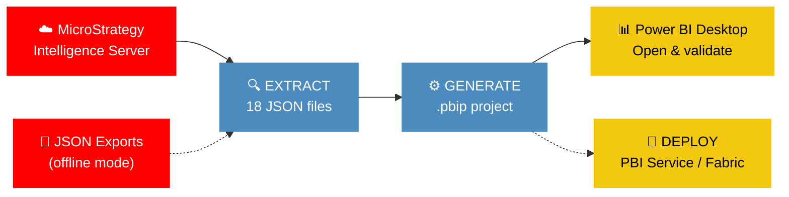

<p align="center">
  
  
  
  
</p>

<h1 align="center">MicroStrategy to Power BI / Fabric Migration</h1>

<p align="center">
  <strong>Migrate your MicroStrategy reports, dossiers & semantic layer to Power BI in seconds — fully automated, zero manual rework.</strong>
</p>

<p align="center">
  
  
  
  
  
</p>

<p align="center">
  <a href="#-quick-start">Quick Start</a> •
  <a href="#-key-features">Features</a> •
  <a href="#-how-it-works">How It Works</a> •
  <a href="#-dax-conversions-100-functions">DAX Mappings</a> •
  <a href="#-visual-type-mapping-30">Visual Mapping</a> •
  <a href="#-deployment">Deployment</a> •
  <a href="#-documentation">Docs</a>
</p>

---

## ⚡ Quick Start

```bash
# That's it. One command.
python migrate.py --server https://mstr.company.com/MicroStrategyLibrary \
    --username admin --password secret --project "Sales Analytics" \
    --dossier "Executive Dashboard"
```

> [!TIP]
> The output is a `.pbip` project — just double-click to open in **Power BI Desktop** (December 2025+).

<details>
<summary><b>📦 Installation</b></summary>

```bash
git clone https://github.com/your-org/MicroStrategy-To-PowerBI.git
cd MicroStrategy-To-PowerBI
pip install -r requirements.txt
python migrate.py --help
```

**Requirements:** Python 3.9+ • `requests` for REST API access

Optional (for deployment):
```bash
pip install azure-identity
```
</details>

### More ways to migrate

```bash
# ☁️ Migrate a single report
python migrate.py --server URL --username admin --password secret \
    --project "Sales Analytics" --report "Monthly Revenue Report"

# 📁 Batch — migrate all dossiers in a project
python migrate.py --server URL --username admin --password secret \
    --project "Sales Analytics" --batch --output-dir /tmp/output

# 🔍 Pre-migration readiness assessment
python migrate.py --server URL --username admin --password secret \
    --project "Sales Analytics" --assess

# 🚀 Migrate + deploy to Power BI Service in one shot
python migrate.py --server URL --username admin --password secret \
    --project "Sales Analytics" --dossier "Executive Dashboard" \
    --deploy WORKSPACE_ID --deploy-refresh

# 🔗 Shared Semantic Model — merge project schema into one model
python migrate.py --server URL --username admin --password secret \
    --project "Sales Analytics" --shared-model --output-dir artifacts/

# 🧙 Interactive wizard (guided step-by-step)
python migrate.py --server URL --username admin --password secret \
    --project "Sales Analytics" --wizard

# 🔑 LDAP / SAML / OAuth authentication
python migrate.py --server URL --username admin --password secret \
    --auth-mode ldap --project "Sales Analytics" --batch

# 📤 Offline mode (from JSON exports instead of REST API)
python migrate.py --from-export ./mstr_exports/ --output-dir /tmp/output
```

---

## 🎯 Key Features

<table>
<tr>
<td width="50%">

### 🔄 Complete Extraction
Connects to MicroStrategy via **REST API v2** and extracts **20 object types**: attributes, facts, metrics (simple + compound + derived + OLAP), reports, dossiers, cubes, filters, prompts, custom groups, consolidations, hierarchies, security filters, freeform SQL, thresholds, warehouse connections

</td>
<td width="50%">

### 🧮 100+ DAX Conversions
Translates MicroStrategy expressions to DAX: aggregations, **level metrics** (`{~+, Year}`, `{!Region}`, `{^}`), **derived metrics** (Rank, RunningSum, MovingAvg, Lag, Lead, NTile), ApplySimple SQL, If/Case, null handling, 60+ function mappings

</td>
</tr>
<tr>
<td>

### 📊 30+ Visual Types
Maps every MicroStrategy visualization to Power BI: grid, cross-tab, vertical/horizontal bar, line, area, pie, ring, scatter, bubble, map, filled map, treemap, waterfall, funnel, gauge, KPI, combo, heatmap, histogram, box plot, word cloud, network

</td>
<td>

### 🔌 15+ Data Connectors
Generates **Power Query M** for: SQL Server, Oracle, PostgreSQL, MySQL, Teradata, Netezza, DB2, Snowflake, Databricks, BigQuery, SAP HANA, Impala, Vertica, ODBC/JDBC, Fabric Lakehouse

</td>
</tr>
<tr>
<td>

### 🧠 Smart Semantic Model
Auto-generates: attribute forms → columns (ID hidden, DESC display), facts → measures with format strings, hierarchies → TMDL hierarchies, security filters → **RLS roles**, Calendar table with Year/Quarter/Month/Day, display folders, geographic data categories

</td>
<td>

### 🚀 Deploy Anywhere
One-command deploy to **Power BI Service** or **Microsoft Fabric** with Azure AD auth (Service Principal / Managed Identity). Gateway config generation for on-premises warehouses.

</td>
</tr>
<tr>
<td colspan="2">

### 🔗 Shared Semantic Model
Entire MicroStrategy project schema → **one shared Power BI semantic model** with thin reports per dossier. Attribute/fact/metric deduplication across all reports. Fabric bundle deployment as an atomic unit.

</td>
</tr>
</table>

> [!NOTE]
> Zero external dependencies for core migration. The entire engine runs on Python's standard library + `requests`.

---

## 🔧 How It Works



**Step 1 — Extract:** Connects to MicroStrategy REST API and extracts schema + report definitions into 18 structured JSON files

**Step 2 — Generate:** Converts JSON into a complete `.pbip` project with PBIR v4.0 report and TMDL semantic model

**Step 3 — Deploy** *(optional):* Packages and uploads to Power BI Service or Microsoft Fabric

### 📂 Generated Output

```
YourReport/
├── YourReport.pbip                     ← Double-click to open in PBI Desktop
├── migration_summary.json              ← Stats, fidelity scores, warnings
├── migration_report.html               ← Visual fidelity dashboard
├── .gitignore
├── YourReport.SemanticModel/
│   ├── .platform
│   ├── definition.pbism
│   └── definition/
│       ├── model.tmdl                  ← Model header + culture
│       ├── relationships.tmdl          ← Table relationships
│       ├── roles.tmdl                  ← Row-Level Security
│       └── tables/
│           ├── FACT_SALES.tmdl         ← Columns + DAX measures
│           ├── LU_CUSTOMER.tmdl        ← Lookup table
│           └── Calendar.tmdl           ← Auto-generated date table
└── YourReport.Report/
    ├── .platform
    └── definition/
        ├── report.json                 ← PBIR v4.0 manifest
        └── pages/
            └── <pageId>/
                └── page.json           ← Visuals + layout
```

---

## 🧮 DAX Conversions (100+ functions)

> Full reference: [docs/MSTR_TO_DAX_REFERENCE.md](docs/MSTR_TO_DAX_REFERENCE.md)

### Highlights

```
┌───────────────────────────────────────────────────────────────────────────┐
│  MicroStrategy Expression              →  Power BI DAX                   │
├───────────────────────────────────────────────────────────────────────────┤
│  Sum(Revenue) {~+, Year}                                                 │
│  → CALCULATE(SUM(Sales[Revenue]), ALLEXCEPT(Sales, Sales[Year]))         │
│                                                                           │
│  Sum(Revenue) {^}                                                        │
│  → CALCULATE(SUM(Sales[Revenue]), ALL(Sales))                            │
│                                                                           │
│  Revenue / Sum(Revenue) {^}                                              │
│  → DIVIDE([Revenue], CALCULATE([Revenue], ALL(Sales)))                   │
│                                                                           │
│  Rank(Revenue) {Month}                                                   │
│  → RANKX(ALL(Calendar[Month]), [Revenue])                                │
│                                                                           │
│  Lag(Revenue, 1) {Month}                                                 │
│  → OFFSET([Revenue], -1, Calendar, ORDERBY(Calendar[Month]))            │
│                                                                           │
│  If(Revenue > 1000, "High", "Low")                                       │
│  → IF([Revenue] > 1000, "High", "Low")                                   │
│                                                                           │
│  NullToZero(Sum(Revenue) / Sum(Quantity))                                │
│  → DIVIDE(SUM(Sales[Revenue]), SUM(Sales[Quantity]), 0)                  │
└───────────────────────────────────────────────────────────────────────────┘
```

<details>
<summary><b>📋 Complete conversion table (click to expand)</b></summary>

| Category | MicroStrategy | DAX |
|----------|---------------|-----|
| **Aggregation** | `Sum(Fact)` | `SUM(Table[Column])` |
| | `Avg(Fact)` | `AVERAGE(Table[Column])` |
| | `Count(Attr)` | `COUNT(Table[Column])` |
| | `Count(Distinct Attr)` | `DISTINCTCOUNT(Table[Column])` |
| | `Min(Fact)` | `MIN(Table[Column])` |
| | `Max(Fact)` | `MAX(Table[Column])` |
| | `StDev(Fact)` | `STDEV.S(Table[Column])` |
| | `Median(Fact)` | `MEDIAN(Table[Column])` |
| | `Product(Fact)` | `PRODUCTX(Table, Table[Column])` |
| **Level Metrics** | `Sum(Rev) {~+, Year}` | `CALCULATE(SUM(...), ALLEXCEPT(..., Year))` |
| | `Sum(Rev) {!Region}` | `CALCULATE(SUM(...), REMOVEFILTERS(Region))` |
| | `Sum(Rev) {^}` | `CALCULATE(SUM(...), ALL(Table))` |
| **Derived** | `Rank(Metric)` | `RANKX(ALL(...), [Metric])` |
| | `RunningSum(Metric)` | `WINDOW(...)` pattern |
| | `MovingAvg(Metric, 3)` | `AVERAGEX(TOPN(3, ...), ...)` |
| | `Lag(Metric, 1)` | `OFFSET([Metric], -1, ...)` |
| | `Lead(Metric, 1)` | `OFFSET([Metric], 1, ...)` |
| | `NTile(Metric, 4)` | RANKX-based quartile pattern |
| **Conditional** | `If(cond, a, b)` | `IF(cond, a, b)` |
| | `Case(expr, val, res)` | `SWITCH(expr, val, res)` |
| | `NullToZero(expr)` | `IF(ISBLANK(expr), 0, expr)` |
| **String** | `Concat(a, b)` | `a & b` |
| | `Length(str)` | `LEN(str)` |
| | `Upper(str)` | `UPPER(str)` |
| | `Substr(str, pos, len)` | `MID(str, pos, len)` |
| | `Trim(str)` | `TRIM(str)` |
| **Date** | `Year(date)` | `YEAR(date)` |
| | `Month(date)` | `MONTH(date)` |
| | `Day(date)` | `DAY(date)` |
| | `DaysBetween(d1, d2)` | `DATEDIFF(d1, d2, DAY)` |
| | `CurrentDate()` | `TODAY()` |
| **Math** | `Abs(x)` | `ABS(x)` |
| | `Round(x, n)` | `ROUND(x, n)` |
| | `Power(x, n)` | `POWER(x, n)` |
| | `Log(x)` | `LOG(x)` |
| | `Exp(x)` | `EXP(x)` |
| **ApplySimple** | `ApplySimple("SQL", args)` | Converted to equivalent DAX or flagged for manual review |

</details>

---

## 📊 Visual Type Mapping (30+)

<details>
<summary><b>🎨 Full visual mapping table (click to expand)</b></summary>

| MicroStrategy | Power BI | Category |
|---------------|----------|----------|
| Vertical Bar | `clusteredColumnChart` | Bar & Column |
| Stacked Vertical Bar | `stackedColumnChart` | Bar & Column |
| 100% Stacked Vertical Bar | `hundredPercentStackedColumnChart` | Bar & Column |
| Horizontal Bar | `clusteredBarChart` | Bar & Column |
| Stacked Horizontal Bar | `stackedBarChart` | Bar & Column |
| 100% Stacked Horizontal Bar | `hundredPercentStackedBarChart` | Bar & Column |
| Histogram | `clusteredColumnChart` | Bar & Column |
| Pareto | `lineClusteredColumnComboChart` | Bar & Column |
| Line | `lineChart` | Line & Area |
| Stacked Area | `stackedAreaChart` | Line & Area |
| Area | `areaChart` | Line & Area |
| Combo (Bar+Line) | `lineClusteredColumnComboChart` | Combo |
| Combo (Stacked+Line) | `lineStackedColumnComboChart` | Combo |
| Pie | `pieChart` | Pie & Donut |
| Ring / Donut | `donutChart` | Pie & Donut |
| Funnel | `funnel` | Funnel |
| Scatter | `scatterChart` | Scatter |
| Bubble | `scatterChart` (size encoding) | Scatter |
| Map (points) | `map` | Geography |
| Map (filled) | `filledMap` | Geography |
| Grid | `tableEx` | Table |
| Cross-tab | `matrix` | Table |
| Heat Map | `matrix` (cond. format) | Table |
| Treemap | `treemap` | Hierarchy |
| Waterfall | `waterfall` | Hierarchy |
| KPI | `kpi` | KPI & Gauge |
| Gauge | `gauge` | KPI & Gauge |
| Box Plot | `boxAndWhisker` | Statistical |
| Word Cloud | `wordCloud` | Text |
| Text Box | `textbox` | Static |
| Image | `image` | Static |

</details>

---

## 🏗️ Architecture

<details>
<summary><b>📁 Project structure (click to expand)</b></summary>

```
MicrostratToPowerBI/
├── migrate.py                          ← CLI entry point
├── config.example.json                 ← Configuration template
├── pyproject.toml                      ← Package config
├── requirements.txt                    ← Dependencies
│
├── microstrategy_export/               ── Step 1: Extraction Layer ──
│   ├── extract_mstr_data.py            # Orchestrator (online + offline)
│   ├── rest_api_client.py              # REST API client (auth, pagination, retry)
│   ├── schema_extractor.py             # Tables, attributes, facts, hierarchies
│   ├── metric_extractor.py             # Simple/compound/derived metrics, thresholds
│   ├── expression_converter.py         # MSTR expressions → DAX (60+ functions)
│   ├── report_extractor.py             # Grid/graph reports
│   ├── dossier_extractor.py            # Dossier chapters/pages/visualizations
│   ├── cube_extractor.py               # Intelligent cubes
│   ├── prompt_extractor.py             # Prompts → slicers/parameters
│   ├── security_extractor.py           # Security filters → RLS
│   └── connection_mapper.py            # 15+ DB types → Power Query M
│
├── powerbi_import/                     ── Step 2: Generation Layer ──
│   ├── import_to_powerbi.py            # Import orchestrator
│   ├── pbip_generator.py               # .pbip project assembly
│   ├── tmdl_generator.py               # TMDL semantic model
│   ├── visual_generator.py             # PBIR v4.0 visual JSON
│   ├── m_query_generator.py            # Power Query M expressions
│   └── migration_report.py             # Fidelity report (JSON + HTML)
│
├── tests/                              ── 385 tests ──
│   ├── fixtures/                       # API response + intermediate JSON fixtures
│   ├── test_tmdl_generator.py          # 48 tests
│   ├── test_visual_generator.py        # 97 tests
│   ├── test_expression_converter.py    # 57 tests
│   ├── test_pbip_assembly.py           # 45 tests
│   ├── test_rest_api_client.py         # 28 tests
│   ├── test_m_query_generator.py       # 19 tests
│   ├── test_connection_mapper.py       # 15 tests
│   ├── test_metric_extractor.py        # 15 tests
│   └── ...                             # + schema, report, dossier, advanced tests
│
└── docs/                               ── Documentation ──
    ├── MIGRATION_PLAN.md               # Sprint execution plan
    ├── MAPPING_REFERENCE.md            # All MSTR→PBI mappings
    ├── MSTR_TO_DAX_REFERENCE.md        # Expression conversion reference
    ├── ARCHITECTURE.md                 # Pipeline design
    ├── TEST_STRATEGY.md                # Test coverage strategy
    ├── KNOWN_LIMITATIONS.md            # Gaps & approximations
    ├── MIGRATION_CHECKLIST.md          # Enterprise migration guide
    └── DEVELOPMENT_PLAN.md             # Sprint roadmap
```

</details>

---

## 📝 CLI Reference

<details>
<summary><b>🔧 All CLI flags (click to expand)</b></summary>

```
Usage: python migrate.py [OPTIONS]

Connection:
  --server URL             MicroStrategy Library URL
  --username USER          Username
  --password PASS          Password
  --auth-mode MODE         Authentication: standard | ldap | saml | oauth
  --project PROJECT        Project name to migrate

Scope:
  --dossier NAME           Migrate a single dossier by name
  --report NAME            Migrate a single report by name
  --report-id ID           Migrate a report by GUID
  --batch                  Migrate all dossiers + reports in the project

Output:
  --output-dir DIR         Output directory (default: artifacts/)
  --report-name NAME       Override generated report name

Generation:
  --calendar-start YEAR    Calendar table start year
  --calendar-end YEAR      Calendar table end year
  --culture LOCALE         Culture/locale (default: en-US)

Deploy:
  --deploy WORKSPACE_ID    Deploy to Power BI workspace
  --deploy-refresh         Trigger dataset refresh after deploy

Advanced:
  --assess                 Pre-migration readiness assessment only
  --shared-model           Merge all into one semantic model
  --wizard                 Interactive step-by-step mode
  --from-export DIR        Offline mode: read from JSON export directory
```

</details>

---

## 🚀 Deployment

<details>
<summary><b>Power BI Service</b></summary>

```bash
# Deploy to Power BI Service workspace
python migrate.py --server URL --username admin --password secret \
    --project "Sales" --dossier "Dashboard" \
    --deploy WORKSPACE_ID --deploy-refresh
```

Requires `azure-identity` package and a Service Principal or Managed Identity with Power BI API permissions.

</details>

<details>
<summary><b>Microsoft Fabric</b></summary>

```bash
# Deploy to Fabric workspace
python migrate.py --server URL --username admin --password secret \
    --project "Sales" --batch \
    --deploy FABRIC_WORKSPACE_ID
```

Supports DirectLake mode for Fabric Lakehouses.

</details>

---

## ✅ Validation

The migration pipeline includes built-in validation:

```python
from powerbi_import.migration_report import generate_migration_report

# After migration, generate a fidelity report
report = generate_migration_report(data, stats, "artifacts/")
# → migration_report.json + migration_report.html
```

The fidelity report classifies every migrated object:
- **Fully Migrated** — exact conversion, no manual work needed
- **Approximated** — close equivalent, minor differences
- **Manual Review** — requires human verification
- **Unsupported** — no Power BI equivalent

---

## 🧪 Testing

<p>
  
  
  
</p>

```bash
python -m pytest tests/ -v                          # Run all 385 tests
python -m pytest tests/test_tmdl_generator.py -v    # Run specific file
python -m pytest tests/ --cov --cov-report=html     # Coverage report
```

<details>
<summary><b>📋 Test suite breakdown (click to expand)</b></summary>

| Test File | Tests | Coverage Area |
|-----------|-------|---------------|
| `test_visual_generator.py` | 97 | 30+ visual type mappings, data bindings, page layout, PBIR manifest |
| `test_expression_converter.py` | 57 | 60+ function mappings, level metrics, derived metrics, ApplySimple |
| `test_tmdl_generator.py` | 48 | Tables, columns, measures, relationships, hierarchies, RLS, calendar |
| `test_pbip_assembly.py` | 45 | .pbip scaffold, SemanticModel, Report, migration report, E2E pipeline |
| `test_rest_api_client.py` | 28 | Client init, auth modes, API URLs, object constants, error handling |
| `test_m_query_generator.py` | 19 | 10+ DB types, freeform SQL, fixture validation |
| `test_connection_mapper.py` | 15 | SQL Server, Oracle, PostgreSQL, MySQL, Snowflake, Databricks, etc. |
| `test_metric_extractor.py` | 15 | Simple/compound/derived metrics, thresholds, format strings |
| `test_schema_extractor.py` | 20+ | Attributes, facts, tables, hierarchies, custom groups, freeform SQL |
| `test_report_extractor.py` | 3 | Grid/graph report extraction |
| `test_dossier_extractor.py` | 4 | Dossier chapter/page/visualization extraction |
| `test_advanced_extraction.py` | 8 | Cubes, prompts, security filters, search results |

</details>

---

## 📊 Migration Report

After migration, a visual **HTML Migration Report** is generated with per-object fidelity scores:

- **Fidelity Score** — overall migration quality (0–100%)
- **Per-object breakdown** — which metrics, reports, visuals were fully migrated vs. approximated
- **Generation summary** — tables, measures, pages, visuals, relationships created
- **Action items** — objects flagged for manual review

---

## 📚 Documentation

| Document | Description |
|----------|-------------|
| 📖 [Migration Checklist](docs/MIGRATION_CHECKLIST.md) | Step-by-step enterprise migration guide |
| 🗺️ [Mapping Reference](docs/MAPPING_REFERENCE.md) | MicroStrategy → Power BI object mappings |
| 🔢 [100+ DAX Functions](docs/MSTR_TO_DAX_REFERENCE.md) | Complete expression conversion reference |
| 🏗️ [Architecture](docs/ARCHITECTURE.md) | Pipeline design & module responsibilities |
| 📋 [Migration Plan](docs/MIGRATION_PLAN.md) | Sprint execution plan with status tracking |
| 🧪 [Test Strategy](docs/TEST_STRATEGY.md) | Test categories, coverage targets & guidelines |
| ⚠️ [Known Limitations](docs/KNOWN_LIMITATIONS.md) | Unsupported features & approximations |
| 📅 [Development Plan](docs/DEVELOPMENT_PLAN.md) | Sprint-by-sprint implementation roadmap |
| 📝 [Changelog](CHANGELOG.md) | Release history |
| 🤝 [Contributing](CONTRIBUTING.md) | How to contribute |

---

## ⚠️ Known Limitations

- `ApplySimple()` with complex SQL is flagged for manual review — no universal DAX equivalent
- `OLAP functions` (RunningSum, MovingAvg) use approximated DAX window patterns — may need manual tuning
- Data source connection strings must be reconfigured in Power Query after migration
- Network/Sankey visualizations require AppSource custom visuals — not built-in to Power BI
- MicroStrategy prompt expressions with complex logic may need manual slicer configuration
- See [docs/KNOWN_LIMITATIONS.md](docs/KNOWN_LIMITATIONS.md) for the full list

---

## 🤝 Contributing

Contributions are welcome! See [CONTRIBUTING.md](CONTRIBUTING.md) for guidelines.

```bash
git clone https://github.com/your-org/MicroStrategy-To-PowerBI.git
cd MicroStrategy-To-PowerBI
pip install -r requirements.txt
python -m pytest tests/ -q     # Make sure all 385 tests pass
```

---

<p align="center">
  Built with ❤️ for the Power BI community<br/>
  If this tool saves you time, consider giving it a ⭐
</p>

## License

MIT
