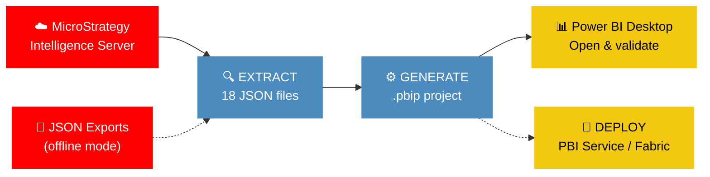

<p align="center">
  
  
  
  
</p>

<h1 align="center">MicroStrategy to Power BI / Fabric Migration</h1>

<p align="center">
  <strong>Migrate your MicroStrategy reports, dossiers & semantic layer to Power BI in seconds — fully automated, zero manual rework.</strong>
</p>

<p align="center">
  
  
  
  
  
</p>

<p align="center">
  <a href="#-quick-start">Quick Start</a> •
  <a href="#-key-features">Features</a> •
  <a href="#-how-it-works">How It Works</a> •
  <a href="#-dax-conversions-100-functions">DAX Mappings</a> •
  <a href="#-visual-type-mapping-30">Visual Mapping</a> •
  <a href="#-deployment">Deployment</a> •
  <a href="#-documentation">Docs</a>
</p>

---

## ⚡ Quick Start

```bash
# That's it. One command.
python migrate.py --server https://mstr.company.com/MicroStrategyLibrary \
    --username admin --password secret --project "Sales Analytics" \
    --dossier "Executive Dashboard"
```

> [!TIP]
> The output is a `.pbip` project — just double-click to open in **Power BI Desktop** (December 2025+).

<details>
<summary><b>📦 Installation</b></summary>

```bash
git clone https://github.com/cyphou/MicroStrategyToPowerBI.git
cd MicroStrategyToPowerBI
pip install -r requirements.txt
python migrate.py --help
```

**Requirements:** Python 3.9+ • `requests` for REST API access

Optional (for deployment):
```bash
pip install azure-identity
```
</details>

### More ways to migrate

```bash
# ☁️ Migrate a single report
python migrate.py --server URL --username admin --password secret \
    --project "Sales Analytics" --report "Monthly Revenue Report"

# 📁 Batch — migrate all dossiers in a project
python migrate.py --server URL --username admin --password secret \
    --project "Sales Analytics" --batch --output-dir /tmp/output

# 🔍 Pre-migration readiness assessment
python migrate.py --server URL --username admin --password secret \
    --project "Sales Analytics" --assess

# 📊 Portfolio-wide assessment (all projects in a directory)
python migrate.py --global-assess ./mstr_exports/ --output-dir assessment/

# 🧭 Strategy recommendation (Import vs DirectQuery vs Composite vs DirectLake)
python migrate.py --server URL --username admin --password secret \
    --project "Sales Analytics" --strategy

# 📋 Side-by-side comparison report after migration
python migrate.py --server URL --username admin --password secret \
    --project "Sales Analytics" --dossier "Executive Dashboard" --compare

# 🚀 Migrate + deploy to Power BI Service in one shot
python migrate.py --server URL --username admin --password secret \
    --project "Sales Analytics" --dossier "Executive Dashboard" \
    --deploy WORKSPACE_ID --deploy-refresh

# 🔗 Shared Semantic Model — merge project schema into one model
python migrate.py --server URL --username admin --password secret \
    --project "Sales Analytics" --shared-model --output-dir artifacts/

# 🧙 Interactive wizard (guided step-by-step)
python migrate.py --server URL --username admin --password secret \
    --project "Sales Analytics" --wizard

# 🔑 LDAP / SAML / OAuth authentication
python migrate.py --server URL --username admin --password secret \
    --auth-mode ldap --project "Sales Analytics" --batch

# 📤 Offline mode (from JSON exports instead of REST API)
python migrate.py --from-export ./mstr_exports/ --output-dir /tmp/output

# 🏭 Fabric-native mode — Lakehouse + DirectLake + PySpark notebooks + Data Factory
python migrate.py --from-export ./mstr_exports/ \
    --fabric-mode lakehouse --lakehouse-name SalesLakehouse

# 🤖 AI-assisted migration (Azure OpenAI fallback for complex expressions)
python migrate.py --from-export ./mstr_exports/ --ai-assist \
    --ai-endpoint https://myopenai.openai.azure.com/ \
    --ai-deployment gpt-4o --ai-budget 100000

# 🌍 Multi-language output (TMDL cultures + translations)
python migrate.py --from-export ./mstr_exports/ --cultures en-US,fr-FR,de-DE

# ⚡ Real-time & streaming — push datasets + Eventstreams + refresh schedules
python migrate.py --from-export ./mstr_exports/ --realtime

# 🔄 Change detection & drift monitoring (incremental re-migration)
python migrate.py --from-export ./mstr_exports/ --watch --previous-dir ./v1_export/

# 🔀 Three-way reconciliation (preserve manual PBI edits during re-migration)
python migrate.py --from-export ./mstr_exports/ --reconcile \
    --previous-dir ./v1_export/ --baseline-dir ./v1_output/

# 🔧 DAX optimization pass (IF→SWITCH, ISBLANK→COALESCE, nested CALCULATE flattening)
python migrate.py --from-export ./mstr_exports/ --optimize-dax

# ⏰ Auto Time Intelligence (YTD, PY, YoY% variants for date measures)
python migrate.py --from-export ./mstr_exports/ --auto-time-intelligence

# 🗺️ Data lineage graph + HTML visualization
python migrate.py --from-export ./mstr_exports/ --lineage

# ☁️ Register in Microsoft Purview
python migrate.py --from-export ./mstr_exports/ --purview myaccount

# 🏗️ Deploy bundle to Fabric (shared model + thin reports, atomic with rollback)
python migrate.py --from-export ./mstr_exports/ --shared-model \
    --deploy WORKSPACE_ID --fabric --deploy-env prod
```

---

## 🎯 Key Features

<table>
<tr>
<td width="50%">

### 🔄 Complete Extraction
Connects to MicroStrategy via **REST API v2** and extracts **20 object types**: attributes, facts, metrics (simple + compound + derived + OLAP), reports, dossiers, cubes, filters, prompts, custom groups, consolidations, hierarchies, security filters, freeform SQL, thresholds, scorecards, warehouse connections. **Real-time source detection** classifies dashboards as batch/near-realtime/streaming.

</td>
<td width="50%">

### 🧮 100+ DAX Conversions
Translates MicroStrategy expressions to DAX: aggregations, **level metrics** (`{~+, Year}`, `{!Region}`, `{^}`), **derived metrics** (Rank, RunningSum, MovingAvg, Lag, Lead, NTile), ApplySimple SQL, If/Case, null handling, 60+ function mappings. **AI-assisted fallback** via Azure OpenAI for unconvertible expressions (ApplySimple/ApplyAgg/ApplyOLAP).

</td>
</tr>
<tr>
<td>

### 📊 30+ Visual Types
Maps every MicroStrategy visualization to Power BI: grid, cross-tab, vertical/horizontal bar, line, area, pie, ring, scatter, bubble, map, filled map, treemap, waterfall, funnel, gauge, KPI, combo, heatmap, histogram, box plot, word cloud, network, scorecards → PBI Goals

</td>
<td>

### 🔌 15+ Data Connectors
Generates **Power Query M** for: SQL Server, Oracle, PostgreSQL, MySQL, Teradata, Netezza, DB2, Snowflake, Databricks, BigQuery, SAP HANA, Impala, Vertica, ODBC/JDBC, Fabric Lakehouse. **Dataflow Gen2** generation with 6 connector templates for Fabric Lakehouse destinations.

</td>
</tr>
<tr>
<td>

### 🧠 Smart Semantic Model
Auto-generates: attribute forms → columns (ID hidden, DESC display), facts → measures with format strings, hierarchies → TMDL hierarchies, security filters → **RLS roles**, Calendar table with Year/Quarter/Month/Day, display folders, geographic data categories. **DirectLake** mode with entity partition bindings.

</td>
<td>

### 🚀 Deploy Anywhere
One-command deploy to **Power BI Service** or **Microsoft Fabric** with Azure AD auth (Service Principal / Managed Identity / interactive browser). **Atomic bundle deployment** (shared model + thin reports) with rollback on failure. Post-deployment endorsement (Promoted/Certified). Environment-based config (dev/staging/prod).

</td>
</tr>
<tr>
<td>

### 🏭 Fabric-Native Generation
Full Fabric pipeline: **Lakehouse DDL** (Delta tables), **PySpark ETL notebooks** (JDBC/Snowflake/BigQuery), **Dataflow Gen2** (Power Query M ingestion), **DirectLake semantic model**, **Data Factory pipelines** (copy + refresh + notification), **OneLake shortcuts**, capacity estimation (F2–F64).

</td>
<td>

### 🤖 AI-Assisted Migration
Azure OpenAI fallback for complex expressions: 10 curated few-shot MSTR→DAX examples, DAX syntax validation, response caching, configurable token budget. **Semantic field matcher** with fuzzy matching, 90+ abbreviation expansions, correction learning.

</td>
</tr>
<tr>
<td>

### 🔧 DAX Optimizer
AST-based DAX rewriting: `ISBLANK→COALESCE`, chained `IF→SWITCH`, nested `CALCULATE` flattening, redundant `CALCULATE` removal. **Time Intelligence injection**: auto-generate YTD (`TOTALYTD`), PY (`SAMEPERIODLASTYEAR`), YoY% variants for date-based measures.

</td>
<td>

### 🌍 Multi-Language i18n
30+ supported cultures with TMDL `cultures.tmdl` + `translations.tmdl`. Locale-aware format strings (currency, date, number). **RTL layout** for Arabic/Hebrew/Farsi/Urdu. Auto-detect locale from datasource connections.

</td>
</tr>
<tr>
<td>

### ⚡ Real-Time & Streaming
Classify MSTR dashboards as batch/near-realtime/streaming. Generate **Push Datasets** (PBI REST API), **Fabric Eventstream** definitions, and **refresh schedules** mapped from MSTR cache/subscription policies.

</td>
<td>

### 🔄 Migration Ops
**Change detection** between extraction runs. **Drift monitoring** to detect manual PBI edits. **Three-way reconciliation**: apply MSTR changes while preserving user edits. Cron-compatible scheduled migration pipeline.

</td>
</tr>
<tr>
<td>

### 📋 14-Category Assessment
Pre-migration readiness check with **GREEN/YELLOW/RED** scoring: expressions, visuals, connectors, security, prompts, hierarchies, relationships, data types, formatting, calculated tables, partitions, RLS, aggregations, advanced features. Effort estimation in hours.

</td>
<td>

### 🧭 Strategy Advisor
Automatic **Import, DirectQuery, Composite, or DirectLake** recommendation based on data volume, refresh frequency, query patterns, and Fabric availability. Always recommends DirectLake when Fabric is available.

</td>
</tr>
<tr>
<td>

### 🗺️ Data Lineage & Governance
In-memory DAG: warehouse → MSTR → PBI. **Impact analysis** ("what breaks if column X changes?"). Interactive D3.js lineage HTML. **Microsoft Purview** integration with sensitivity classification. 6-category governance checklist (ownership, classification, RLS, lineage, documentation, readiness).

</td>
<td>

### 🛡️ Quality Gates
**Equivalence testing** (cross-platform value comparison + SSIM screenshots). **Regression snapshots** (SHA-256 drift detection). **Security validation** (path traversal, ZIP slip, XXE, dangerous extensions). **Property-based** + **fuzz testing** (150+ adversarial inputs).

</td>
</tr>
<tr>
<td colspan="2">

### 🔗 Shared Semantic Model + Thin Reports
Entire MicroStrategy project schema → **one shared Power BI semantic model** with thin reports per dossier. Attribute/fact/metric deduplication across all reports. **Fabric bundle deployment** as an atomic unit with automatic rollback.

</td>
</tr>
</table>

> [!NOTE]
> Zero external dependencies for core migration. The entire engine runs on Python's standard library + `requests`.

---

## 🔧 How It Works



**Step 1 — Extract:** Connects to MicroStrategy REST API and extracts schema + report definitions into 18 structured JSON files

**Step 2 — Generate:** Converts JSON into a complete `.pbip` project with PBIR v4.0 report and TMDL semantic model

**Step 3 — Deploy** *(optional):* Packages and uploads to Power BI Service or Microsoft Fabric

### 📂 Generated Output

```
YourReport/
├── YourReport.pbip                     ← Double-click to open in PBI Desktop
├── migration_summary.json              ← Stats, fidelity scores, warnings
├── migration_report.html               ← Visual fidelity dashboard
├── .gitignore
├── YourReport.SemanticModel/
│   ├── .platform
│   ├── definition.pbism
│   └── definition/
│       ├── model.tmdl                  ← Model header + culture
│       ├── relationships.tmdl          ← Table relationships
│       ├── roles.tmdl                  ← Row-Level Security
│       └── tables/
│           ├── FACT_SALES.tmdl         ← Columns + DAX measures
│           ├── LU_CUSTOMER.tmdl        ← Lookup table
│           └── Calendar.tmdl           ← Auto-generated date table
└── YourReport.Report/
    ├── .platform
    └── definition/
        ├── report.json                 ← PBIR v4.0 manifest
        └── pages/
            └── <pageId>/
                └── page.json           ← Visuals + layout
```

---

## 🧮 DAX Conversions (100+ functions)

> Full reference: [docs/MSTR_TO_DAX_REFERENCE.md](docs/MSTR_TO_DAX_REFERENCE.md)
>
> With `--ai-assist`: Azure OpenAI fallback for unconvertible ApplySimple/ApplyAgg/ApplyOLAP expressions.
> With `--optimize-dax`: AST-based rewriting (IF→SWITCH, ISBLANK→COALESCE, nested CALCULATE flattening).

### Highlights

```
┌───────────────────────────────────────────────────────────────────────────┐
│  MicroStrategy Expression              →  Power BI DAX                   │
├───────────────────────────────────────────────────────────────────────────┤
│  Sum(Revenue) {~+, Year}                                                 │
│  → CALCULATE(SUM(Sales[Revenue]), ALLEXCEPT(Sales, Sales[Year]))         │
│                                                                           │
│  Sum(Revenue) {^}                                                        │
│  → CALCULATE(SUM(Sales[Revenue]), ALL(Sales))                            │
│                                                                           │
│  Revenue / Sum(Revenue) {^}                                              │
│  → DIVIDE([Revenue], CALCULATE([Revenue], ALL(Sales)))                   │
│                                                                           │
│  Rank(Revenue) {Month}                                                   │
│  → RANKX(ALL(Calendar[Month]), [Revenue])                                │
│                                                                           │
│  Lag(Revenue, 1) {Month}                                                 │
│  → OFFSET([Revenue], -1, Calendar, ORDERBY(Calendar[Month]))            │
│                                                                           │
│  If(Revenue > 1000, "High", "Low")                                       │
│  → IF([Revenue] > 1000, "High", "Low")                                   │
│                                                                           │
│  NullToZero(Sum(Revenue) / Sum(Quantity))                                │
│  → DIVIDE(SUM(Sales[Revenue]), SUM(Sales[Quantity]), 0)                  │
└───────────────────────────────────────────────────────────────────────────┘
```

<details>
<summary><b>📋 Complete conversion table (click to expand)</b></summary>

| Category | MicroStrategy | DAX |
|----------|---------------|-----|
| **Aggregation** | `Sum(Fact)` | `SUM(Table[Column])` |
| | `Avg(Fact)` | `AVERAGE(Table[Column])` |
| | `Count(Attr)` | `COUNT(Table[Column])` |
| | `Count(Distinct Attr)` | `DISTINCTCOUNT(Table[Column])` |
| | `Min(Fact)` | `MIN(Table[Column])` |
| | `Max(Fact)` | `MAX(Table[Column])` |
| | `StDev(Fact)` | `STDEV.S(Table[Column])` |
| | `Median(Fact)` | `MEDIAN(Table[Column])` |
| | `Product(Fact)` | `PRODUCTX(Table, Table[Column])` |
| **Level Metrics** | `Sum(Rev) {~+, Year}` | `CALCULATE(SUM(...), ALLEXCEPT(..., Year))` |
| | `Sum(Rev) {!Region}` | `CALCULATE(SUM(...), REMOVEFILTERS(Region))` |
| | `Sum(Rev) {^}` | `CALCULATE(SUM(...), ALL(Table))` |
| **Derived** | `Rank(Metric)` | `RANKX(ALL(...), [Metric])` |
| | `RunningSum(Metric)` | `WINDOW(...)` pattern |
| | `MovingAvg(Metric, 3)` | `AVERAGEX(TOPN(3, ...), ...)` |
| | `Lag(Metric, 1)` | `OFFSET([Metric], -1, ...)` |
| | `Lead(Metric, 1)` | `OFFSET([Metric], 1, ...)` |
| | `NTile(Metric, 4)` | RANKX-based quartile pattern |
| **Conditional** | `If(cond, a, b)` | `IF(cond, a, b)` |
| | `Case(expr, val, res)` | `SWITCH(expr, val, res)` |
| | `NullToZero(expr)` | `IF(ISBLANK(expr), 0, expr)` |
| **String** | `Concat(a, b)` | `a & b` |
| | `Length(str)` | `LEN(str)` |
| | `Upper(str)` | `UPPER(str)` |
| | `Substr(str, pos, len)` | `MID(str, pos, len)` |
| | `Trim(str)` | `TRIM(str)` |
| **Date** | `Year(date)` | `YEAR(date)` |
| | `Month(date)` | `MONTH(date)` |
| | `Day(date)` | `DAY(date)` |
| | `DaysBetween(d1, d2)` | `DATEDIFF(d1, d2, DAY)` |
| | `CurrentDate()` | `TODAY()` |
| **Math** | `Abs(x)` | `ABS(x)` |
| | `Round(x, n)` | `ROUND(x, n)` |
| | `Power(x, n)` | `POWER(x, n)` |
| | `Log(x)` | `LOG(x)` |
| | `Exp(x)` | `EXP(x)` |
| **ApplySimple** | `ApplySimple("SQL", args)` | Converted to equivalent DAX or flagged for manual review |

</details>

---

## 📊 Visual Type Mapping (30+)

<details>
<summary><b>🎨 Full visual mapping table (click to expand)</b></summary>

| MicroStrategy | Power BI | Category |
|---------------|----------|----------|
| Vertical Bar | `clusteredColumnChart` | Bar & Column |
| Stacked Vertical Bar | `stackedColumnChart` | Bar & Column |
| 100% Stacked Vertical Bar | `hundredPercentStackedColumnChart` | Bar & Column |
| Horizontal Bar | `clusteredBarChart` | Bar & Column |
| Stacked Horizontal Bar | `stackedBarChart` | Bar & Column |
| 100% Stacked Horizontal Bar | `hundredPercentStackedBarChart` | Bar & Column |
| Histogram | `clusteredColumnChart` | Bar & Column |
| Pareto | `lineClusteredColumnComboChart` | Bar & Column |
| Line | `lineChart` | Line & Area |
| Stacked Area | `stackedAreaChart` | Line & Area |
| Area | `areaChart` | Line & Area |
| Combo (Bar+Line) | `lineClusteredColumnComboChart` | Combo |
| Combo (Stacked+Line) | `lineStackedColumnComboChart` | Combo |
| Pie | `pieChart` | Pie & Donut |
| Ring / Donut | `donutChart` | Pie & Donut |
| Funnel | `funnel` | Funnel |
| Scatter | `scatterChart` | Scatter |
| Bubble | `scatterChart` (size encoding) | Scatter |
| Map (points) | `map` | Geography |
| Map (filled) | `filledMap` | Geography |
| Grid | `tableEx` | Table |
| Cross-tab | `matrix` | Table |
| Heat Map | `matrix` (cond. format) | Table |
| Treemap | `treemap` | Hierarchy |
| Waterfall | `waterfall` | Hierarchy |
| KPI | `kpi` | KPI & Gauge |
| Gauge | `gauge` | KPI & Gauge |
| Box Plot | `boxAndWhisker` | Statistical |
| Word Cloud | `wordCloud` | Text |
| Text Box | `textbox` | Static |
| Image | `image` | Static |

</details>

---

## 🏗️ Architecture

<details>
<summary><b>📁 Project structure (click to expand)</b></summary>

```
MicrostratToPowerBI/
├── migrate.py                          ← CLI entry point (50+ flags)
├── wizard.py                           ← Interactive step-by-step wizard
├── config.example.json                 ← Configuration template
├── pyproject.toml                      ← Package config
├── requirements.txt                    ← Dependencies
│
├── microstrategy_export/               ── Step 1: Extraction Layer ──
│   ├── extract_mstr_data.py            # Orchestrator (online + offline)
│   ├── rest_api_client.py              # REST API client (auth, pagination, retry)
│   ├── schema_extractor.py             # Tables, attributes, facts, hierarchies
│   ├── metric_extractor.py             # Simple/compound/derived metrics, thresholds
│   ├── expression_converter.py         # MSTR expressions → DAX (60+ functions)
│   ├── report_extractor.py             # Grid/graph reports
│   ├── dossier_extractor.py            # Dossier chapters/pages/visualizations
│   ├── cube_extractor.py               # Intelligent cubes
│   ├── prompt_extractor.py             # Prompts → slicers/parameters
│   ├── security_extractor.py           # Security filters → RLS
│   ├── connection_mapper.py            # 15+ DB types → Power Query M
│   ├── scorecard_extractor.py          # Scorecards → PBI Goals
│   ├── realtime_extractor.py           # Real-time source classification
│   ├── incremental.py                  # Incremental extraction (delta)
│   ├── parallel.py                     # Parallel extraction workers
│   └── change_detector.py              # Change detection (diff vs previous run)
│
├── powerbi_import/                     ── Step 2: Generation Layer (39 modules) ──
│   ├── import_to_powerbi.py            # Import orchestrator
│   ├── pbip_generator.py               # .pbip project assembly
│   ├── tmdl_generator.py               # TMDL semantic model (Import + DirectLake)
│   ├── visual_generator.py             # PBIR v4.0 visual JSON
│   ├── m_query_generator.py            # Power Query M expressions
│   ├── validator.py                    # TMDL/PBIR/DAX validation
│   │
│   │  ── Assessment & Reporting ──
│   ├── assessment.py                   # 14-category pre-migration assessment
│   ├── migration_report.py             # Per-object fidelity report (JSON + HTML)
│   ├── dashboard.py                    # Interactive HTML fidelity dashboard
│   ├── server_assessment.py            # Server-wide portfolio assessment
│   ├── global_assessment.py            # Multi-project global assessment
│   ├── comparison_report.py            # Source-vs-output comparison report
│   ├── visual_diff.py                  # Visual field coverage analysis
│   ├── strategy_advisor.py             # Import/DQ/Composite/DirectLake advisor
│   │
│   │  ── Shared Models & Merge ──
│   ├── shared_model.py                 # Shared semantic model generator
│   ├── thin_report_generator.py        # Thin reports (shared model reference)
│   ├── merge_assessment.py             # Merge assessment report
│   ├── merge_config.py                 # Per-table merge rules
│   ├── merge_report_html.py            # Merge assessment HTML
│   │
│   │  ── Fabric-Native Generation ──
│   ├── fabric_constants.py             # Spark type maps, JDBC maps, sanitization
│   ├── fabric_naming.py                # Name sanitization & collision detection
│   ├── fabric_semantic_model_generator.py  # DirectLake semantic model
│   ├── dataflow_generator.py           # Dataflow Gen2 (M → Lakehouse)
│   ├── calc_column_utils.py            # Expression classification (Lakehouse vs DAX)
│   ├── lakehouse_generator.py          # Delta table DDL + OneLake shortcuts
│   ├── notebook_generator.py           # PySpark ETL notebooks
│   ├── pipeline_generator.py           # Data Factory pipelines
│   │
│   │  ── AI & Intelligence ──
│   ├── ai_converter.py                 # Azure OpenAI LLM fallback for DAX
│   ├── semantic_matcher.py             # Fuzzy column matching + correction learning
│   ├── dax_optimizer.py                # AST-based DAX rewriting + Time Intelligence
│   │
│   │  ── i18n & Streaming ──
│   ├── i18n.py                         # Multi-language cultures & translations
│   ├── streaming_generator.py          # Push datasets + Eventstream + refresh
│   │
│   │  ── Lineage & Governance ──
│   ├── lineage.py                      # Data lineage DAG + impact analysis
│   ├── lineage_report.py              # Interactive D3.js lineage HTML
│   ├── purview_integration.py          # Microsoft Purview asset registration
│   ├── governance_report.py            # 6-category governance checklist
│   │
│   │  ── Migration Ops ──
│   ├── drift_report.py                 # Drift detection (live vs baseline)
│   ├── reconciler.py                   # Three-way merge (MSTR × PBI × baseline)
│   │
│   │  ── Quality & Validation ──
│   ├── equivalence_tester.py           # Cross-platform value comparison + SSIM
│   ├── regression_suite.py             # Golden snapshot generation/comparison
│   ├── security_validator.py           # Path traversal, ZIP slip, XXE defense
│   ├── certification.py                # Post-migration certification (PASS/FAIL)
│   │
│   │  ── Telemetry & Plugins ──
│   ├── telemetry.py                    # Migration run data collection
│   ├── telemetry_dashboard.py          # Historical run dashboard
│   ├── progress.py                     # Progress bar wrapper
│   ├── plugins.py                      # Plugin extension system
│   ├── goals_generator.py              # Scorecards → PBI Goals
│   ├── theme_generator.py              # Theme extraction
│   │
│   └── deploy/                         ── Deployment ──
│       ├── auth.py                     # Azure AD (SP / MI / browser + token cache)
│       ├── client.py                   # Fabric REST API client (retry, pagination)
│       ├── bundle_deployer.py          # Atomic bundle deploy + rollback
│       ├── fabric_deployer.py          # Fabric REST API deployment
│       ├── fabric_git.py               # Push .pbip to Fabric workspace Git
│       ├── fabric_env.py               # Spark environment + capacity estimation
│       ├── pbi_deployer.py             # Power BI Service deployment
│       ├── gateway_config.py           # On-premises gateway configuration
│       └── refresh_config.py           # Refresh schedule migration
│
├── scripts/
│   ├── generate_tests.py               # Auto-generate parametrized tests
│   └── scheduled_migration.py          # Cron-compatible migration pipeline
│
├── tests/                              ── 2,458 tests across 35 test files ──
│   ├── fixtures/                       # API response + intermediate JSON fixtures
│   └── test_*.py                       # Unit, integration, property, fuzz tests
│
├── examples/                           ── Example Projects ──
│   ├── simple/                         # 1 table, 3 metrics, 1 report
│   ├── medium/                         # 3 tables, 12 metrics, 3 reports, 1 dossier
│   ├── complex/                        # 6 tables, 25 metrics, 5 reports, 3 dossiers, RLS
│   └── ultra_complex/                  # 12 tables, 60 metrics, 15 reports, 8 dossiers, multi-source
│
└── docs/                               ── Documentation ──
    ├── DEVELOPMENT_PLAN.md             # Sprint-by-sprint roadmap (v1–v19)
    ├── ARCHITECTURE.md                 # Pipeline design & module map
    ├── MAPPING_REFERENCE.md            # All MSTR→PBI mappings
    ├── MSTR_TO_DAX_REFERENCE.md        # 100+ expression conversions
    ├── MIGRATION_CHECKLIST.md          # Enterprise migration guide
    ├── TEST_STRATEGY.md                # Test categories & coverage
    ├── KNOWN_LIMITATIONS.md            # Unsupported features
    ├── TROUBLESHOOTING.md              # Top-20 migration issues
    ├── MIGRATION_PLAN.md               # Sprint execution plan
    └── CHANGELOG.md                    # Release history
```

</details>

---

## 📝 CLI Reference

<details>
<summary><b>🔧 All CLI flags (click to expand)</b></summary>

```
Usage: python migrate.py [OPTIONS]

Connection:
  --server URL             MicroStrategy Library URL
  --username USER          Username
  --password PASS          Password
  --auth-mode MODE         Authentication: standard | ldap | saml | oauth
  --project PROJECT        Project name to migrate

Scope:
  --dossier NAME           Migrate a single dossier by name
  --report NAME            Migrate a single report by name
  --report-id ID           Migrate a report by GUID
  --batch                  Migrate all dossiers + reports in the project

Output:
  --output-dir DIR         Output directory (default: artifacts/)
  --report-name NAME       Override generated report name
  --cultures LOCALES       Comma-separated culture list (e.g., en-US,fr-FR,de-DE)

Offline Mode:
  --from-export DIR        Read from JSON export directory instead of REST API

Generation:
  --calendar-start YEAR    Calendar table start year
  --calendar-end YEAR      Calendar table end year
  --culture LOCALE         Culture/locale (default: en-US)
  --no-calendar            Suppress Calendar table generation

Deploy:
  --deploy WORKSPACE_ID    Deploy to Power BI workspace
  --deploy-refresh         Trigger dataset refresh after deploy
  --fabric                 Deploy to Microsoft Fabric instead of PBI Service
  --tenant-id ID           Azure tenant ID for deployment
  --client-id ID           Azure app client ID for deployment
  --client-secret SECRET   Azure app client secret for deployment
  --lakehouse-id ID        Fabric Lakehouse ID for DirectLake
  --direct-lake            Configure DirectLake mode (requires --lakehouse-id)
  --deploy-env ENV         Deployment environment: dev | staging | prod

Assessment:
  --assess                 Pre-migration readiness assessment (14 categories)
  --global-assess DIR      Portfolio-wide assessment across multiple projects
  --strategy               Strategy recommendation (Import/DQ/Composite/DirectLake)
  --compare                Side-by-side comparison report after migration

Advanced:
  --shared-model           Merge all into one semantic model
  --wizard                 Interactive step-by-step mode
  --no-calendar            Suppress Calendar table generation
  --config FILE            Path to configuration JSON file
  --verbose / -v           Enable verbose (DEBUG) logging
  --quiet / -q             Suppress all output except errors
  --log-file FILE          Write logs to file

v4.0 Features:
  --merge DIR              Merge N intermediate-JSON project dirs into one shared model
  --merge-config FILE      Path to merge-config.json for conflict resolution
  --scorecards             Extract and convert MicroStrategy scorecards to PBI Goals
  --certify                Run post-migration certification (PASS/FAIL verdict)
  --certify-threshold PCT  Minimum fidelity % for certification (default: 80)
  --benchmark              Run performance benchmark on the generation pipeline

v5.0 Fabric Native:
  --fabric-mode MODE       Fabric-native artifacts: lakehouse | warehouse | shortcut
  --lakehouse-name NAME    Fabric Lakehouse name (default: MstrLakehouse)
  --fabric-git             Push generated .pbip to Fabric workspace Git repo
  --fabric-git-branch BR   Branch for Fabric Git push (default: main)
  --adls-account ACCT      ADLS account for OneLake shortcuts
  --adls-container CTR     ADLS container for shortcuts (default: data)
  --env-name NAME          Fabric Spark environment name (default: MstrSparkEnv)

v6.0 Governance & Lineage:
  --lineage                Generate data lineage graph and HTML report
  --purview ACCOUNT        Register migrated assets in Microsoft Purview
  --governance             Generate governance checklist report

v7.0 AI-Assisted Migration:
  --ai-assist              Enable LLM fallback for unconvertible expressions
  --ai-endpoint URL        Azure OpenAI endpoint URL
  --ai-key KEY             Azure OpenAI API key
  --ai-deployment NAME     Azure OpenAI deployment name
  --ai-budget TOKENS       Maximum total tokens for AI conversion (default: 500000)

v9.0 Real-Time & Streaming:
  --realtime               Detect real-time sources and generate push/Eventstream/refresh

v11.0 Migration Ops:
  --watch                  Detect changes between current and previous extraction
  --reconcile              Three-way reconcile: preserve manual PBI edits
  --previous-dir DIR       Previous extraction output (for change detection)
  --baseline-dir DIR       Previous migration output (for reconciliation)

v15.0 DAX Optimization:
  --optimize-dax           Apply DAX optimization rewrites
  --auto-time-intelligence Inject YTD, PY, YoY% variants for date measures
  --snapshot-update        Re-baseline regression snapshots
```

</details>

---

## 🚀 Deployment

<details>
<summary><b>Power BI Service</b></summary>

```bash
# Deploy to Power BI Service workspace
python migrate.py --server URL --username admin --password secret \
    --project "Sales" --dossier "Dashboard" \
    --deploy WORKSPACE_ID --deploy-refresh
```

Requires `azure-identity` package and a Service Principal or Managed Identity with Power BI API permissions.

</details>

<details>
<summary><b>Microsoft Fabric — DirectLake</b></summary>

```bash
# Fabric-native pipeline: Lakehouse DDL + PySpark notebooks + DirectLake model
python migrate.py --from-export ./mstr_exports/ \
    --fabric-mode lakehouse --lakehouse-name SalesLakehouse \
    --deploy FABRIC_WORKSPACE_ID --fabric --deploy-env prod

# Deploy bundle: shared semantic model + thin reports (atomic with rollback)
python migrate.py --from-export ./mstr_exports/ --shared-model \
    --deploy FABRIC_WORKSPACE_ID --fabric --deploy-env staging
```

Supports DirectLake mode for Fabric Lakehouses with entity partition bindings. Includes Dataflow Gen2, PySpark ETL notebooks, Data Factory pipelines, and capacity estimation (F2–F64).

</details>

<details>
<summary><b>Fabric Git Integration</b></summary>

```bash
# Push .pbip to Fabric workspace Git repository
python migrate.py --from-export ./mstr_exports/ \
    --deploy WORKSPACE_ID --fabric-git --fabric-git-branch main \
    --client-id APP_ID --client-secret SECRET --tenant-id TENANT
```

</details>

<details>
<summary><b>Environment-Based Deployment</b></summary>

```bash
# Use dev/staging/prod configs for deployment settings
python migrate.py --from-export ./mstr_exports/ \
    --deploy WORKSPACE_ID --fabric --deploy-env dev

# Environment configs control: workspace IDs, endorsement level, capacity SKU
```

Environments: `dev` (no endorsement), `staging` (Promoted), `prod` (Certified).

</details>

---

## ✅ Validation

The migration pipeline includes built-in validation:

```python
from powerbi_import.migration_report import generate_migration_report

# After migration, generate a fidelity report
report = generate_migration_report(data, stats, "artifacts/")
# → migration_report.json + migration_report.html
```

The fidelity report classifies every migrated object:
- **Fully Migrated** — exact conversion, no manual work needed
- **Approximated** — close equivalent, minor differences
- **Manual Review** — requires human verification
- **Unsupported** — no Power BI equivalent

---

## 🧪 Testing

<p>
  
  
  
</p>

```bash
python -m pytest tests/ -v                          # Run all 2,458 tests
python -m pytest tests/test_tmdl_generator.py -v    # Run specific file
python -m pytest tests/ --cov --cov-report=html     # Coverage report
```

<details>
<summary><b>📋 Test suite breakdown (click to expand)</b></summary>

| Test File | Coverage Area |
|-----------|---------------|
| `test_visual_generator.py` | 30+ visual type mappings, data bindings, page layout, PBIR manifest |
| `test_validator.py` | TMDL/PBIR/assessment validation rules |
| `test_v2_features.py` | Wizard, advanced DAX, parallel extraction, incremental migration |
| `test_expression_converter.py` | 60+ function mappings, level metrics, derived metrics, ApplySimple |
| `test_tmdl_generator.py` | Tables, columns, measures, relationships, hierarchies, RLS, calendar |
| `test_v3_features.py` | Assessment, strategy advisor, visual diff, telemetry, plugins |
| `test_pbip_assembly.py` | .pbip scaffold, SemanticModel, Report, migration report, E2E |
| `test_rest_api_client.py` | Client init, auth modes, API URLs, error handling |
| `test_generated.py` | Auto-generated parametrized tests from mapping tables (181 cases) |
| `test_properties.py` | Property-based tests (100+ randomized invariants) |
| `test_fuzz.py` | 50+ adversarial inputs (malformed, SQL injection, unicode) |
| `test_gap_filling.py` | Coverage for 20+ under-tested modules |
| `test_v4_features.py` | Merge, scorecards, certification, benchmark |
| `test_v5_features.py` | Fabric: Lakehouse, PySpark notebooks, pipelines, OneLake |
| `test_v7_features.py` | AI converter, semantic matcher, correction learning |
| `test_lineage.py` | Lineage DAG, impact analysis, Purview, governance |
| `test_i18n.py` | Multi-language, RTL layout, format strings, culture TMDL |
| `test_streaming.py` | Push datasets, Eventstream, refresh schedules |
| `test_bug_bash.py` | 18 regression tests for crash bugs |
| `test_migops.py` | Change detection, drift, reconciliation, scheduling |
| `test_dax_optimizer.py` | ISBLANK→COALESCE, IF→SWITCH, CALCULATE rules, Time Intelligence |
| `test_quality_gates.py` | Equivalence testing, snapshots, security validation |
| `test_fabric_deep.py` | Spark types, naming, calc columns, Dataflow Gen2, DirectLake model |
| `test_deploy_infra.py` | Auth flows, REST client, bundle deployment, rollback |
| `test_deployment.py` | PBI Service deploy, Fabric deploy, gateway config |
| `test_governance.py` | Governance report, certification, lineage integration |
| `test_integration.py` | End-to-end pipeline, offline mode, batch mode |
| `test_connection_mapper.py` | SQL Server, Oracle, PostgreSQL, MySQL, Snowflake, Databricks |
| `test_metric_extractor.py` | Simple/compound/derived metrics, thresholds, formats |
| `test_schema_extractor.py` | Attributes, facts, tables, hierarchies, custom groups |
| `test_m_query_generator.py` | 10+ DB types, freeform SQL, fixture validation |
| `test_dossier_extractor.py` | Dossier chapter/page/visualization extraction |
| `test_report_extractor.py` | Grid/graph report extraction |
| `test_advanced_extraction.py` | Cubes, prompts, security filters |
| `test_regression.py` | PBI Desktop bug regression |

</details>

---

## 📊 Migration Report

After migration, a visual **HTML Migration Report** is generated with per-object fidelity scores:

- **Fidelity Score** — overall migration quality (0–100%)
- **Per-object breakdown** — which metrics, reports, visuals were fully migrated vs. approximated
- **Generation summary** — tables, measures, pages, visuals, relationships created
- **Action items** — objects flagged for manual review

---

## 📚 Documentation

| Document | Description |
|----------|-------------|
| 📖 [Migration Checklist](docs/MIGRATION_CHECKLIST.md) | Step-by-step enterprise migration guide |
| 🗺️ [Mapping Reference](docs/MAPPING_REFERENCE.md) | MicroStrategy → Power BI object mappings |
| 🔢 [100+ DAX Functions](docs/MSTR_TO_DAX_REFERENCE.md) | Complete expression conversion reference |
| 🏗️ [Architecture](docs/ARCHITECTURE.md) | Pipeline design, module map & data flow |
| 📋 [Migration Plan](docs/MIGRATION_PLAN.md) | Sprint execution plan with status tracking |
| 🧪 [Test Strategy](docs/TEST_STRATEGY.md) | Test categories, 2,458 tests & guidelines |
| ⚠️ [Known Limitations](docs/KNOWN_LIMITATIONS.md) | Unsupported features & approximations |
| 📅 [Development Plan](docs/DEVELOPMENT_PLAN.md) | Sprint-by-sprint roadmap (v1–v19) |
| 🔧 [Troubleshooting](docs/TROUBLESHOOTING.md) | Top-20 migration issues & fixes |
| 📝 [Changelog](CHANGELOG.md) | Release history (v1.0–v16.0) |
| 🤝 [Contributing](CONTRIBUTING.md) | How to contribute |

---

## ⚠️ Known Limitations

- `ApplySimple()` with complex SQL: common patterns auto-converted, complex SQL flagged for manual review — use `--ai-assist` for LLM fallback
- `OLAP functions` (RunningSum, MovingAvg) use approximated DAX window patterns — may need manual tuning
- Data source connection strings must be reconfigured in Power Query after migration
- Network/Sankey visualizations require AppSource custom visuals — not built-in to Power BI
- MicroStrategy prompt expressions with complex logic may need manual slicer configuration
- Transaction Services (write-back) not supported — Power BI does not support write-back natively
- MicroStrategy custom visualization SDK plugins have no Power BI equivalent
- See [docs/KNOWN_LIMITATIONS.md](docs/KNOWN_LIMITATIONS.md) for the full list

---

## 🤝 Contributing

Contributions are welcome! See [CONTRIBUTING.md](CONTRIBUTING.md) for guidelines.

```bash
git clone https://github.com/cyphou/MicroStrategyToPowerBI.git
cd MicroStrategyToPowerBI
pip install -r requirements.txt
python -m pytest tests/ -q     # Make sure all 2,458 tests pass
```

---

<p align="center">
  Built with ❤️ for the Power BI community<br/>
  If this tool saves you time, consider giving it a ⭐
</p>

## License

MIT
