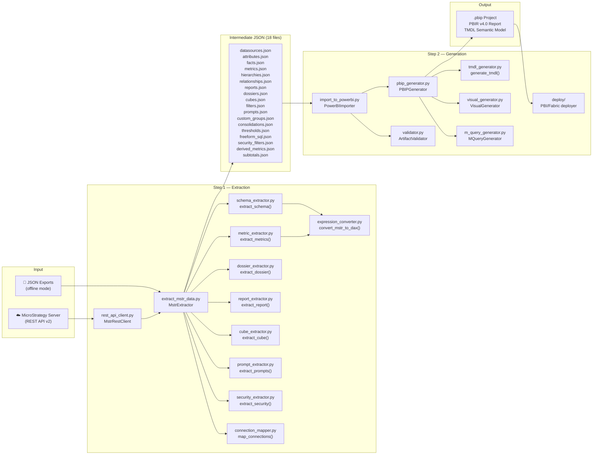

# Architecture — MicroStrategy to Power BI / Fabric Migration Tool

## Pipeline Overview

The migration follows a **2-step pipeline**: Extraction (from MicroStrategy) → Generation (Power BI .pbip).



---

## Module Responsibilities

### Extraction Layer (`microstrategy_export/`)

| Module | Responsibility |
|--------|----------------|
| `rest_api_client.py` | HTTP client for MicroStrategy REST API v2. Authentication (Standard, LDAP, SAML, OAuth). Token management. Pagination. Rate limiting. Retry logic. |
| `extract_mstr_data.py` | Top-level orchestrator. Discovers project objects, delegates to specialized extractors, writes intermediate JSON files. |
| `schema_extractor.py` | Extracts attributes (with forms), facts (with expressions), logical tables, warehouse tables, hierarchies, custom groups, consolidations, freeform SQL. |
| `metric_extractor.py` | Extracts metric definitions (simple, compound, derived/OLAP), thresholds (conditional formatting), format strings. |
| `expression_converter.py` | Parses MicroStrategy expression syntax and converts to DAX. Handles aggregations, level metrics, derived metrics, functions, ApplySimple SQL passthrough. |
| `report_extractor.py` | Extracts report templates (grid rows/columns, metrics, filters, sorts), report graphs, subtotals, legacy documents. |
| `dossier_extractor.py` | Extracts dossier structure: chapters → pages → visualizations → data bindings.  Panel stacks, filter panels, selector controls, info windows. |
| `cube_extractor.py` | Extracts Intelligent Cube definitions: attributes, metrics, filters. Used for import-mode tables. |
| `prompt_extractor.py` | Extracts prompts: value, object, hierarchy, expression, date. Maps to Power BI slicers/parameters. |
| `security_extractor.py` | Extracts security filters (row-level security) with filter expressions and user/group assignments. |
| `connection_mapper.py` | Maps MicroStrategy warehouse connection types to Power Query M connection expressions. |

### Generation Layer (`powerbi_import/`)

| Module | Responsibility |
|--------|----------------|
| `import_to_powerbi.py` | Loads intermediate JSON files and orchestrates generation pipeline. |
| `pbip_generator.py` | Creates `.pbip` project directory structure: `.pbip` file, `.gitignore`, SemanticModel (TMDL), Report (PBIR v4.0). |
| `tmdl_generator.py` | Generates TMDL semantic model: tables (from warehouse tables), columns (from attribute forms + fact columns), measures (from metrics), relationships, hierarchies, RLS roles, Calendar table. Format strings, geographic roles, annotations. |
| `visual_generator.py` | Generates PBIR v4.0 visuals: maps dossier visualizations / report grids+graphs to Power BI visual types with data bindings. |
| `m_query_generator.py` | Generates Power Query M expressions for warehouse connections. Handles 15+ database types + freeform SQL passthrough. |
| `dax_expression_gen.py` | Assembles final DAX expressions for measures, incorporating expression converter output with proper table/column references. |
| `validator.py` | Validates generated artifacts: TMDL syntax, PBIR schema, relationship cycles, DAX references, column type compatibility. |
| `assessment.py` | 14-category pre-migration assessment: CheckItem/CategoryResult/AssessmentReport model. GREEN/YELLOW/RED scoring with effort estimation in hours. |
| `migration_report.py` | Generates migration report (JSON + HTML): per-object status, expression conversion details, warnings, manual review items. |
| `dashboard.py` | Interactive HTML fidelity dashboard: fidelity gauge, type breakdown, heatmap, searchable object table. |
| `shared_model.py` | Shared semantic model: merges all project schema into one model with thin reports per dossier. |
| `thin_report_generator.py` | Thin reports referencing a shared semantic model. PBIR `byPath` or `byConnection` bindings. |
| `server_assessment.py` | Server-wide portfolio assessment: `WorkbookReadiness`, `MigrationWave` planning across multiple projects. |
| `global_assessment.py` | Multi-project global assessment with pairwise-merge clustering and consolidated scoring. |
| `comparison_report.py` | Side-by-side MSTR↔PBI HTML comparison report for post-migration validation. |
| `visual_diff.py` | Visual type + field coverage analysis: identifies missing columns, measure mismatches, layout differences. |
| `strategy_advisor.py` | Import/DirectQuery/Composite/DirectLake mode recommendation with confidence scoring. |
| `telemetry.py` | Migration run data collection: timings, object counts, fidelity scores per run. |
| `telemetry_dashboard.py` | Historical aggregation HTML dashboard across multiple migration runs. |
| `progress.py` | tqdm-based progress bar wrapper with fallback for non-TTY environments. |
| `plugins.py` | Extension point hook system: pre/post extraction, pre/post generation, custom transformation plugins. |
| `deploy/` | Deployment to Power BI Service (REST API) and Microsoft Fabric. Azure AD authentication. Gateway configuration. |

---

## Data Flow: MicroStrategy Concepts → Power BI Concepts

```
MicroStrategy                      Power BI
─────────────                      ────────
Project                    →       Workspace
  └─ Schema                →       Semantic Model
       ├─ Tables           →       TMDL Tables (with M partitions)
       ├─ Attributes       →       Columns (dimension)
       │    └─ Forms       →       Key column + display column
       ├─ Facts            →       Columns + implicit measures
       ├─ Metrics          →       DAX Measures
       │    ├─ Simple      →       SUM/AVG/COUNT DAX
       │    ├─ Compound    →       Nested DAX measures
       │    ├─ Derived     →       RANKX/WINDOW/OFFSET DAX
       │    └─ Level       →       CALCULATE + ALLEXCEPT DAX
       ├─ Hierarchies      →       TMDL Hierarchies
       ├─ Relationships    →       TMDL Relationships
       └─ Security Filters →       TMDL RLS Roles
  └─ Reports               →       Report Pages (thin reports)
       ├─ Grid             →       Table/Matrix visual
       ├─ Graph            →       Chart visual (type mapped)
       ├─ Filters          →       Report/page/visual filters
       ├─ Prompts          →       Slicers / what-if parameters
       └─ Thresholds       →       Conditional formatting
  └─ Dossiers              →       Multi-page Reports
       ├─ Chapters         →       Page groups
       ├─ Pages            →       Report pages
       ├─ Visualizations   →       Visuals (type mapped)
       ├─ Panel Stacks     →       Bookmark navigator
       ├─ Filter Panels    →       Slicers
       └─ Selectors        →       Slicers / field parameters
  └─ Cubes                 →       Import-mode tables
  └─ Warehouse Connections →       Power Query M data sources
```

---

## Key Design Decisions

1. **REST API first**: Primary extraction via MicroStrategy REST API v2 (Modeling API + Report/Dossier API). Offline JSON export as fallback.

2. **Intermediate JSON**: Same pattern as Tableau tool — extraction produces JSON files that generation consumes. Enables debugging and manual inspection.

3. **Expression conversion**: MicroStrategy expressions are more complex than Tableau (level metrics, Apply functions). Dedicated converter with extensive test coverage.

4. **Schema-centric model**: MicroStrategy has a stronger semantic layer than Tableau. The Power BI model mirrors this: attributes→columns, facts→columns, metrics→measures.

5. **Reuse generation layer**: The `powerbi_import/` layer is adapted from the Tableau tool. TMDL generator, visual generator, and deployment modules are extended rather than rewritten.

---

## Multi-Agent Development Architecture

Development is organized around 6 specialized Copilot agents (`.github/agents/`):

```
                    ┌──────────────────┐
                    │   Orchestrator   │
                    │  (migrate.py,    │
                    │   CLI, config,   │
                    │   coordination)  │
                    └────────┬─────────┘
                             │
          ┌──────────────────┼──────────────────┐
          │                  │                  │
  ┌───────▼───────┐  ┌──────▼──────┐  ┌───────▼───────┐
  │  Extraction   │  │ Expression  │  │  Generation   │
  │ microstrategy │  │ converter,  │  │ powerbi_import│
  │  _export/*    │  │ metric_ext  │  │ tmdl, visual, │
  │ REST API→JSON │  │ MSTR→DAX    │  │ pbip, deploy  │
  └───────┬───────┘  └──────┬──────┘  └───────┬───────┘
          │                  │                  │
          └──────────────────┼──────────────────┘
                             │
          ┌──────────────────┼──────────────────┐
          │                                     │
  ┌───────▼───────┐                    ┌───────▼───────┐
  │    Testing    │                    │  Validation   │
  │   tests/*    │                    │  assessment,  │
  │  pytest,     │                    │  fidelity,    │
  │  fixtures    │                    │  reporting    │
  └──────────────┘                    └───────────────┘
```

### Agent → Module Mapping

| Agent | Modules Owned | When to Use |
|-------|--------------|-------------|
| **Orchestrator** | `migrate.py`, `config.example.json`, `docs/`, `pyproject.toml` | CLI changes, config, cross-module integration, sprint planning |
| **Extraction** | `microstrategy_export/*` (all 12 files) | REST API client, schema/report/dossier/cube extraction, JSON output |
| **Expression** | `expression_converter.py`, `metric_extractor.py` | MSTR→DAX conversion, function mappings, level metrics, derived metrics |
| **Generation** | `powerbi_import/*` | TMDL generator, visual generator, pbip assembly, M queries, deployment |
| **Testing** | `tests/*` | Unit tests, integration tests, fixtures, coverage |
| **Validation** | Validation/assessment/reporting modules | Pre-migration assessment, post-gen validation, fidelity scoring, reports |

### Parallel Execution

Agents can work in parallel when their tasks don't share module boundaries:
- Extraction + Generation (once JSON schema is stable)
- Expression works across both layers (shared conversion logic)
- Testing + any feature agent (TDD pattern)
- Validation + Generation (post-generation checks)
